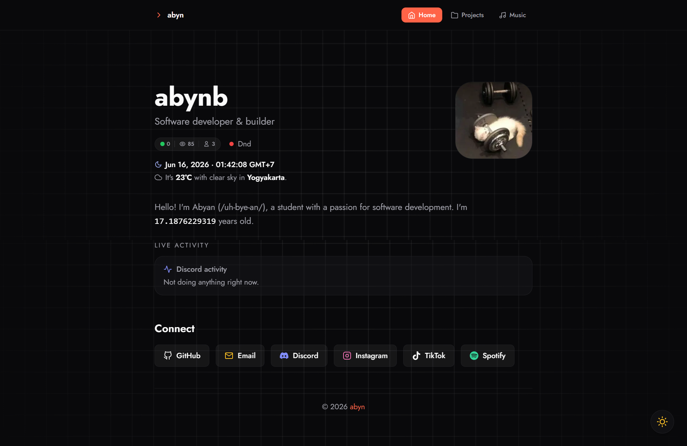
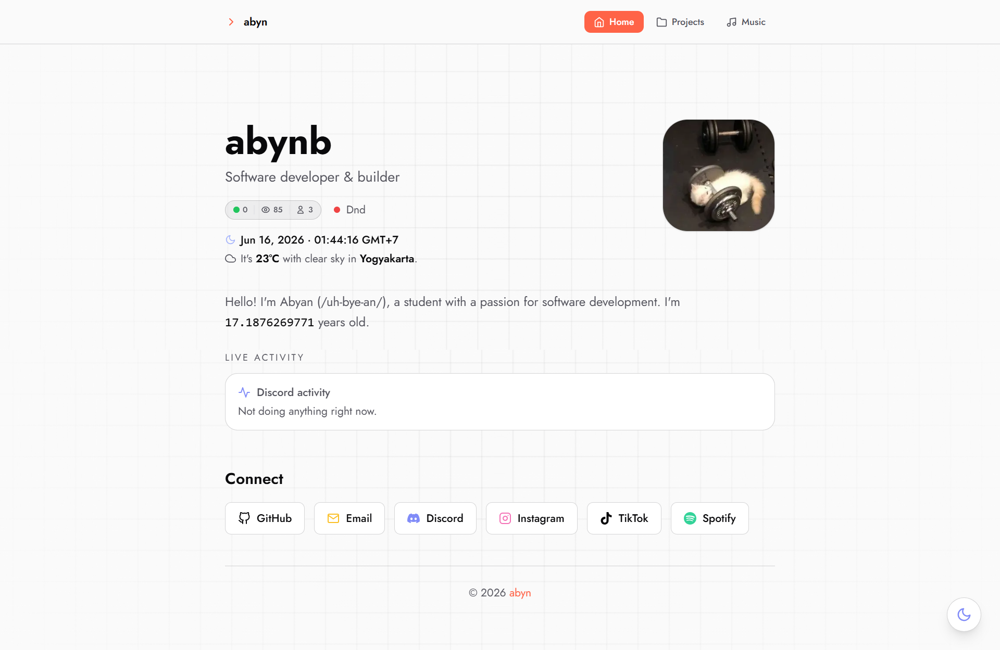

<h1 align="center">abyndotxyz</h1>

  My personal website and portfolio.
   
  Built with ❤️ and powered by a custom API inspired by
  <a href="https://github.com/lrmn7/personal-bio">lrmn7/personal-bio</a>.

  

## Preview

<table>
<tr>
<td align="center">
<b>Dark Theme</b>  

</td>
<td align="center">
<b>Light Theme</b>  

</td>
</tr>
</table>

> Replace the image paths above with your own screenshots.

## Stats

  
  

  

## Metrics

  

## License

MIT
